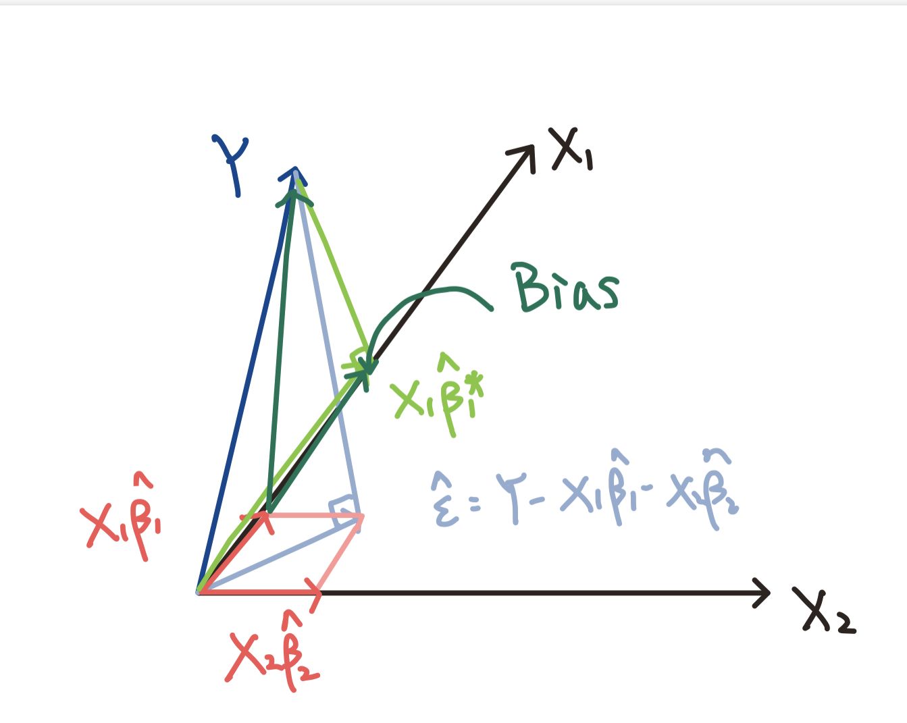

```{r setup, include=FALSE}
knitr::opts_chunk$set(echo = TRUE)
library(MASS)
library(leaps)
library(data.table)
setwd("/Users/hongjingpeng/Desktop/Machine Learning/Machine-Learning-2022W/PSet1")
```


## Question 1
**1.a.**

With the Bonferroni correction, we will reject the null when p-value is less than $(1-\alpha)/p$. Hence the probability of false rejection of the joint null is:
$$P=1-(1-(1-\alpha)/p)^p$$
Given the $\alpha = 0.95$
```{r q1.a}
p1=seq(1, 10, by=1)
plot(p1, 1-(1-(1-0.95)/p1)**p1,
main="Probability of false rejection versus p (0.95, Bonferroni correction)", ylab="Type I Error", xlab="p", type="l", col="blue")
```

**1.b.**

```{r q1.b}
N=20000
rho_ls=seq(0, 1, by=0.2)
p_ls=seq(1, 10, by=1)
prob_error=matrix(NA, nrow = length(rho_ls), ncol = length(p_ls))
i=1
for (rho in rho_ls) {
  j=1
  for (p in p_ls){
    covmat=matrix(rep(rho, p*p), nrow=p, byrow=TRUE)
    diag(covmat)=1
    z=mvrnorm(n=N, mu=rep(0, p), Sigma=covmat)
    c_value=qnorm(0.05/p,lower.tail = FALSE)
    rej=z>c_value
    rejcol=(rowSums(rej)==0)
    prob_error[i,j]=1-sum(rejcol)/N
    j=j+1
  }
  i=i+1
}
plot(p1, 1-(1-(1-0.95)/p1)**p1, main="Probability of false rejection versus p", ylab="Type I Error", type="l", xlab="p", ylim=c(0.02,0.05), col="blue")
lines(prob_error[2,],type="l",col="red")
lines(prob_error[3,],type="l",col="purple")
lines(prob_error[4,],type="l",col="green")
lines(prob_error[5,],type="l",col="orange")
legend("bottomleft",legend=c("1.a", "rho=0.2","rho=0.4","rho=0.6","rho=0.8","rho=1.0"),
       col=c("blue","red","purple","green","orange","black"), lty=1,lwd=2)

```

**1.c.**

The biggest value of $\rho$ is 1, because the non-diagonal entries denote the covariance. Given the variance of all $z$ is 1 and the correlation should lie between -1 and 1,  the covariance should not be greater than 1.

## Question 2

**2.a. Download the data set Hitters from the ISLR library.**
```{r q2.a}
library(ISLR)
```

**2.b. Divide the dataset into a training set and a test set.**

The trade off between having a big training/small test versus small training/big test:

1) If we have a big training, there will be fewer observations for us to estimate the test error rate. Hence, the validation set error rate will have big variance and lead to a poor estimate of the test error rate. In other words, we cannot know the out-of-sample prediction power of the model well.

2) If we have a small training, we cannot have enough observations to train the model. In this way, our estimation of parameters will have greater variance. 

I choose 70% training and 30% test. I use most of the data to train, but will still have sufficient data for out-of-sample evaluation.
```{r q2.b}
Hitters=na.omit(Hitters) # omit the observations with missing values
set.seed(1)
train=sample(c(TRUE,FALSE), size=nrow(Hitters), rep=TRUE, prob=c(0.7,0.3)) # train/test=7/3
test=(!train)
```

**2.c. Select the model made of the 7 coefficients.**

The model made of the 7 coefficients with the smallest p-values is `PutOuts`, `Walks`, `CHits`, `CAtBat`, `DivisionW`, `AtBat` and `Hits`

```{r q2.c}
reg.train=glm(Salary~., data=Hitters[train,])
pvalue=coef(summary(reg.train))[, 4]
pvalue=sort(pvalue, decreasing=FALSE)
```
**2.d. Select the best model made of 7 coefficients according to the forward stepwise selection procedure.**

Forward stepwise selection procedure: Suppose there are $p$ predictors. We begin with a model containing no predictors, and then add one predictors each time until all of the predictors are in the model. In particular, at each step we choose the best variable that gives the greatest additional improvement to the fit. Finally, we select a single best model from the $p+1$ models.

The best model here is `CRuns`, `Hits`, `PutOuts`, `AtBat`, `RBI`, `CWalks` and `Walks`

In c, we select the most significant variable from the full model at the same time. However, in forward stepwise selection procedure, we start with the most significant variable, and add the most significant one among the rest. The forward stepwise selection procedure will be less sensitive to the correlation among variables (e.g. collinearity).
```{r q2.d}
regfit.train.fwd=regsubsets(Salary~.,data=Hitters[train,], nvmax=7, method="forward")
summary(regfit.train.fwd)
```

**2.e. Select the best model made of 7 coefficients according to the best subset procedure.**
```{r q2.e}
regfit.train=regsubsets(Salary~.,data=Hitters[train,], nvmax=7)
summary(regfit.train)
```
**2.f. Compute the sample mean squared error in the test set for each method fitted in c, d and e, and collect the results in a table.**

|  model   | MSE  |
| c  | 490057322.8  |
| d  | 177373.1 |
| e  | 181767.2 |
```{r q2.f}
test.mat=model.matrix(Salary~.,data=Hitters[test,])
mse.test=rep(NA,3)
# MSE in c
coefc=coef(summary(reg.train))[order(pvalue, decreasing=FALSE)][1:7]
predc=test.mat[,names(sort(pvalue, decreasing=FALSE)[1:7])]%*%coefc
mse.test[1]=mean((Hitters$Salary[test]-predc)^2)
# MSE in d
coefd=coef(regfit.train.fwd, id=7)
predd=test.mat[,names(coefd)]%*%coefd
mse.test[2]=mean((Hitters$Salary[test]-predd)^2)
# MSE in e
coefe=coef(regfit.train, id=7)
prede=test.mat[,names(coefe)]%*%coefe
mse.test[3]=mean((Hitters$Salary[test]-prede)^2)
mse.test
```

**2.g. Repeat exercises c-f for different sizes of the subset of coefficients, and present your results in an extended table or plot.**

## Question 3

**3.a.**

The in-sample sum-of-squared errors for this regression is `726316624`and $R^2$ is `0.734876` 
```{r q3.a}
biketab=fread("bikeshare.csv")
# tell R which are factors
biketab[, c("dteday", "mnth","season","weekday","hr","weathersit") := list(
  factor(dteday), factor(mnth), factor(season), 
  factor(weekday), factor(hr), factor(weathersit))] 
# calculates total cnt by day, also keeping track of the corresponding yr and mnth id.
daytots=biketab[, list(total=sum(cnt)), by=c("dteday","yr","mnth")]
row.names(daytots)=daytots$dteday
# simple regression
daylm=glm(total ~ yr*mnth, data=daytots)
names(daylm)
# calculate in-sample sum-of-squared errors
sse=daylm$deviance
print(sse)
# calculate R^2
rsqr=1 - daylm$deviance/daylm$null.deviance
print(rsqr)
```

**3.b.**

The mathematical formula for `daylm` is
$$Total_i = \beta_0 + \beta_1 yr_i + \beta_2 mnth2_i+... + \beta_{12} mnth12_i+\beta_{1,2} yr_i \times mnth2_i+... + \beta_{1,12} yr_i \times mnth12_i+\epsilon_i$$
The assumption we have here is that:

1) $(Total_i, yr_i, mnth1_i,..., mnth12_i)$ is i.i.d.
2) $E[\epsilon_i|X] = 0$

From the OLS, we minimize the function:
$$\sum(Total_i-X_i'\hat{\beta})^2$$

The criticism is that since this is a time-series data set, there will be the correlation of error terms, which violates the i.i.d. assumption.

**3.c.**

The null hypothesis is that the standardized residuals are drawn from the identical distribution $N(0,1)$ independently. Small values indicate the possibility that the data point is drawn from the distribution $N(0,1)$ is low. In other words, it have the different distribution with other days, which indicates a possible outlier day.

```{r q3.c}
rse=sqrt(daylm$deviance/daylm$df.residual) # calculate residual standard error
std_resids=(fitted(daylm) - daytots$total)/rse # standardization
pvalue=pnorm(-abs(std_resids)) # calculate outlier p-values
```

**3.d. Plot the p-value distribution.**

The distribution of p-value is similar to a uniform distribution, which indicates that the standardized residuals follow the $N(0,1)$ and our assumption that $\epsilon ～ N(0,1)$ is likelt to hold.
```{r q3.d} 
plot(density(2*pvalue))
```

## Question 4

Consider the model with $X_1$ and $X_2$:
$$Y=X_1\hat{\beta_1}+X_2\hat{\beta_2}+\hat{\epsilon}$$
Given the projection matrix of $X_1$:
$$P_1=X_1(X_1^TX_1)^{-1}X_1^T$$
Then we have:
$$P_1Y=P_1X_1\hat{\beta_1}+P_1X_2\hat{\beta_2}+P_1\hat{\epsilon}$$
Here, $P_1Y$ is the light green line, $P_1X_1\hat{\beta_1}=X_1\hat{\beta_1}$ is the true effect (the red line). $P_1X_2\hat{\beta_2}$ is the projection of  $X_2\hat{\beta_2}$ on the span of $X_1$, which is the omitted variable bias here. $P_1\hat{\epsilon}=0$ by definition.


